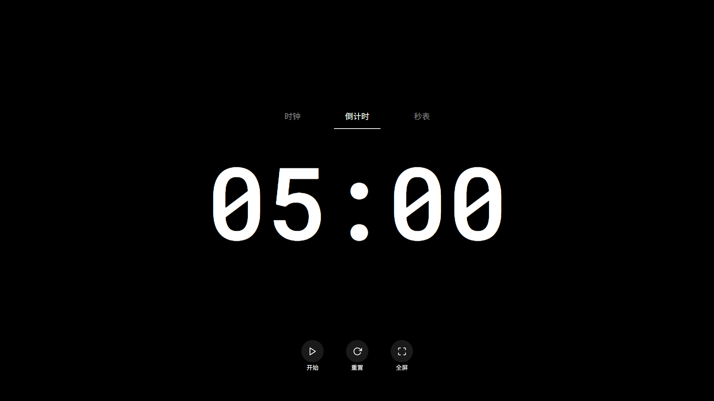

# 沉浸式时钟应用

一个极简、优雅的全屏时钟应用，专为现代教室大型触控显示屏设计，适用于考试计时、晚自习倒计时等场景。应用提供时钟、倒计时和秒表三种模式，采用手势驱动的交互方式，实现沉浸式体验。

[在线访问](https://clock.qqhkx.com/)

## 特点

- **教育场景优化**：专为教室大型触屏设计，适用于考试计时、晚自习倒计时等场景

- **绝对极简设计**：默认视图下，屏幕上只显示时间，无其他元素
- **优雅交互**：通过点击屏幕唤出控制中心，自动隐藏
- **人体工学布局**：高频交互按钮集中在屏幕下半部分，便于触控操作
- **响应式设计**：适配各种屏幕尺寸
- **高性能**：使用requestAnimationFrame实现流畅动画和精确计时

## 功能

### 时钟模式
- 显示当前时间（HH:MM:SS格式）
- 支持全屏显示

### 倒计时模式
- 可设置分钟和秒数
- 提供快捷预设时间（5分钟、15分钟、25分钟、45分钟）
- 最后10秒进入警告状态，数字变为红色并有呼吸动画
- 倒计时结束时播放提示音

### 秒表模式
- 精确计时，显示分钟、秒和毫秒
- 支持开始、暂停和重置功能

## 教育场景应用

1. **考试计时**：设置考试时长，全屏显示倒计时，避免学生分心
2. **课堂活动**：为小组讨论、课堂练习设置分段计时
3. **晚自习管理**：显示剩余自习时间，帮助学生规划学习
4. **课间休息**：设置课间休息倒计时，提醒学生及时返回

## 使用方法

1. **启动应用**：打开index.html文件
2. **切换模式**：点击屏幕，然后在顶部选择所需模式
3. **控制操作**：点击屏幕，在底部使用控制按钮
4. **隐藏控制**：点击时间显示区域或等待8秒自动隐藏
5. **全屏显示**：点击全屏按钮进入/退出全屏模式

### 倒计时特殊操作

1. 点击倒计时数字打开设置面板
2. 使用+/-按钮或预设值设置时间
3. 点击确认按钮保存设置
4. 使用开始/暂停按钮控制倒计时

## 技术实现

- 纯原生JavaScript，无需任何框架
- 使用CSS变量实现一致的设计风格
- 使用requestAnimationFrame实现高性能动画和计时
- 使用Flexbox实现响应式布局
- 使用SVG图标确保在任何尺寸下都清晰显示

## 自定义

您可以通过修改以下文件来自定义应用：

- `styles/variables.css` - 修改颜色、字体、尺寸等变量
- `styles/main.css` - 调整布局和视觉效果
- `assets/sounds/ding.mp3` - 替换倒计时结束音效

## 浏览器兼容性

应用适用于现代浏览器，包括：

- Chrome（推荐）
- Firefox
- Safari
- Edge

## 许可

本项目采用MIT许可证。

## 作者与联系方式

- 作者：QQHKX
- 网站：[https://qqhkx.com/](https://qqhkx.com/)